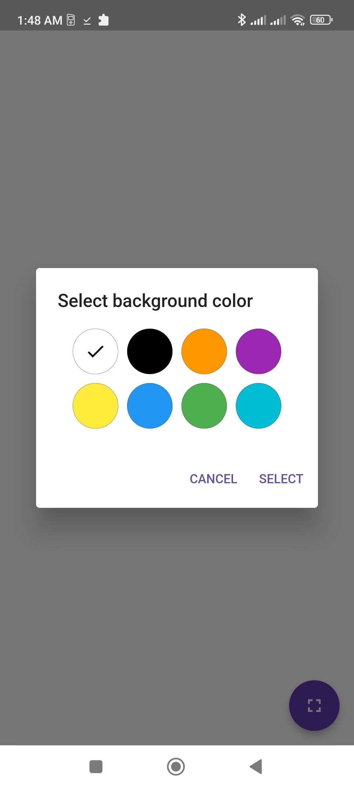

<h1 align="center">White Fullscreen</h1>

Flutter app for Android to show a blank screen.
 
 
Built with ❤︎ by LegendaryB

 

## 🎯 Motivation
I got into photography lately and really like photos were you point your smartphone at the subject and later edit the DSLR photo onto the screen.
So I made this app for simple editing the photos afterwards.

## 🚀 Features
* Keep screen awake while app is in the foreground.
* Tap the empty area to change the color (handy if your smartphone is white for example)
* Maximize app to fullscreen via floating action button

## 🌠 Preview

    
    
    
    

